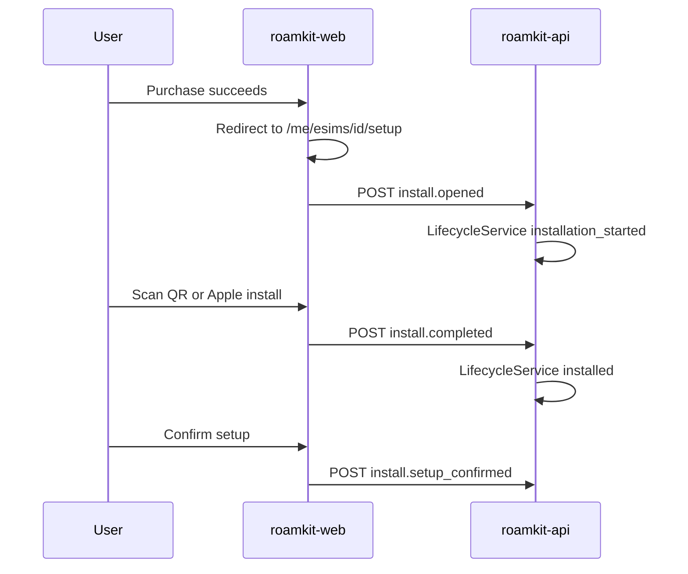
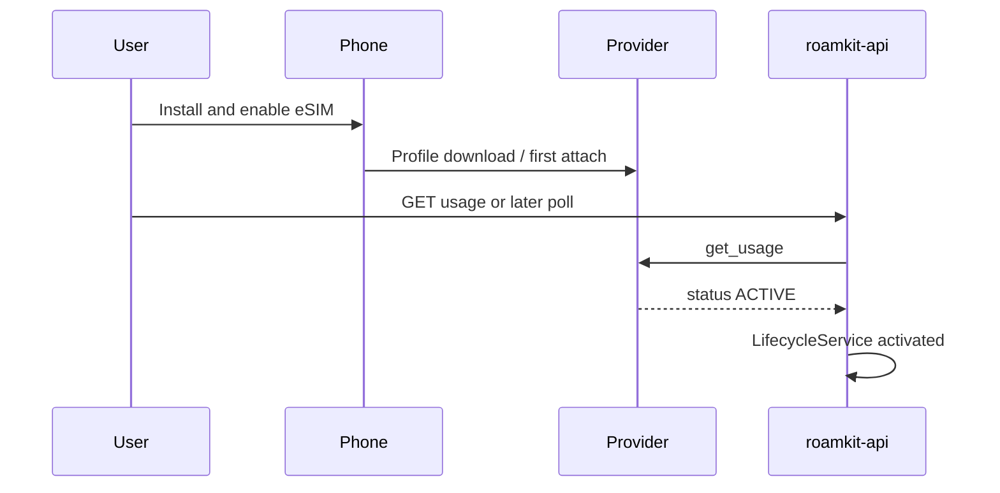
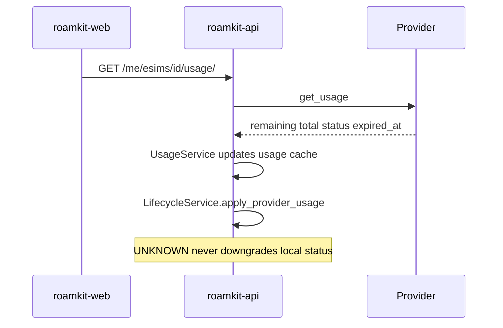

# ADR 014: eSIM lifecycle and install telemetry

| Field | Value |
|-------|-------|
| Status | Accepted |
| Date | 2026-07 |
| Deciders | Faza 5 Wave 1 design freeze |

## Context

Faza 2 shipped purchase, QR/install payload, on-demand usage, and top-up. Post-purchase UX still dumps users on a raw eSIM detail page. `Esim.status` stays `unused` after provision and is not advanced. There is no install funnel telemetry, no purchase-time activation-policy snapshot, and no sole mutator for product lifecycle state.

Without locked lifecycle rules, status writes will sprawl across views and commands (same failure mode ADR 010 avoided for money via `CreditService`).

## Decision

Adopt a **guided post-purchase setup**, a **guarded `Esim.status` state machine** owned only by `LifecycleService`, an **append-only `EsimLifecycleEvent`** trail for install telemetry, and an **activation-policy snapshot on `Esim`** at fulfillment.

### Product state

Expand `Esim.status` (no parallel `lifecycle_status`). Values:

`purchased`, `installation_started`, `installed`, `activated`, `in_use`, `exhausted`, `expired`, `unknown`.

Migration: existing `unused` → `purchased` via Django `RunPython` only (no ops backfill script).

### State machine

Allowed transitions:

```text
purchased → installation_started → installed → activated → in_use
                                                      ↘ exhausted
                                                      ↘ expired
in_use → exhausted | expired
exhausted → expired
purchased → installed   (wizard may skip intermediate telemetry)
```

Forbidden: any reverse transition (e.g. `expired → installed`, `in_use → purchased`).

**Unknown non-downgrade:** if the provider reports `UNKNOWN`, never set local status to `unknown` when current status is already past `purchased`. Keep current status; optionally append `provider.usage_unknown`. `unknown` is reserved for cold/error bootstrap only.

**Sole mutator:** only `LifecycleService` may write `Esim.status`. Architecture test enforces this (same pattern as ADR 010 / `CreditService`).

| Status | Who drives |
|--------|------------|
| `purchased` | `LifecycleService.mark_purchased` on fulfillment |
| `installation_started` / `installed` | Client-attested events → `LifecycleService` |
| `activated` / `in_use` / `exhausted` / `expired` | Provider usage via `LifecycleService.apply_provider_usage` |
| Provider `UNKNOWN` | Event only; no downgrade |

### Setup session fields on `Esim`

| Field | Purpose |
|-------|---------|
| `setup_version` | Wizard version at last open/complete |
| `setup_resume_step` | 1–4 resume position |
| `setup_completed_at` | Wizard finished |
| `setup_skipped_at` | User dismissed setup |

### Activation policy

- `Package.activation_policy` — synced from Airalo for catalog (`first_usage` \| `installation` \| `unknown`).
- `Esim.activation_policy` — **copied at fulfillment** from the package. Wizard/support always read the eSIM snapshot, never the live catalog row.

### `EsimLifecycleEvent` (append-only)

| Field | Notes |
|-------|--------|
| `id` | UUID PK |
| `esim`, `user` | FKs |
| `event_type` | Namespaced string |
| `source` | `client` \| `system` \| `provider` |
| `schema_version` | Payload contract version (start at `1`) |
| `idempotency_key` | Unique per eSIM; retries return existing row |
| `setup_session_id` | Correlates one onboarding run |
| `payload` | JSON |
| `user_agent` | Optional |
| `created_at` | Immutable |

Never update or delete event rows.

### Event taxonomy

Wave 1 implements `install.*` plus minimal `provider.*` / `system.*`. Reserved for later: `usage.*`, `topup.*`, `support.*`, `notification.*`.

Client allowlist (Wave 1): `install.opened`, `install.qr_rendered`, `install.qr_zoomed`, `install.apple_install_clicked`, `install.manual_install_clicked`, `install.completed`, `install.roaming_checklist_viewed`, `install.setup_confirmed`, `install.setup_skipped`.

### API

- `POST /api/v1/me/esims/{id}/events/` — JWT + ownership; idempotent via `idempotency_key`.
- `GET /api/v1/me/esims/{id}/events/` — chronological trail for owned eSIM.
- Cross-user access matches list/detail (`404`). Never accept body `user_id` / foreign `esim_id` to override path ownership.

Additive fields and new endpoints do not bump `/api/v1`. Renaming status `unused` → `purchased` is a **coordinated v1 sole-consumer exception** (OpenAPI changelog + `roamkit-web` same wave). Do not open `/api/v2` for this rename.

### Domain events (ADR 005)

Publish past-tense facts for server transitions (`EsimInstalled`, `EsimActivated`, `EsimFirstUsageDetected`, …). No real transactional email in Wave 1.

### Observability

Countable signals from day one (structured logs and/or counters): `setup_started`, `setup_completed`, `setup_skipped`, `activation_detected`, `purchase_to_activation_seconds`.

## Sequence diagrams

### Install flow



### Activation flow



### Usage sync flow



## Consequences

### Positive

- Product lifecycle has one mutator and testable guards.
- Install funnel is measurable without a notification engine.
- Historical purchases keep activation rules after catalog changes.

### Negative

- Client-attested `installed` can be wrong; support relies on event trail + provider usage.
- Sole-consumer enum rename still requires coordinated web deploy.

## Related

- [ADR 005](./005-domain-events.md)
- [ADR 010](./010-polygon-usdt-prepaid-credits.md) — sole-mutator pattern
- [RFC 002](../rfcs/002-post-purchase-onboarding.md)
- [API versioning](../../standards/api-versioning.md)
