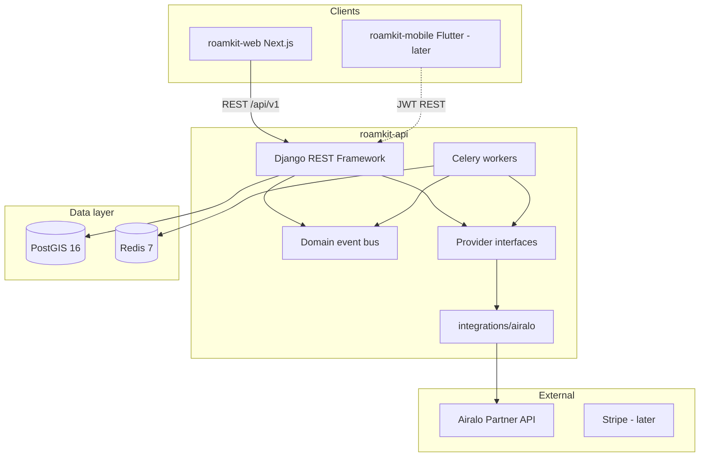

# Architecture Overview

RoamKit is a greenfield eSIM platform: catalog, orders, usage, and billing backed by partner APIs (Airalo first, others later).

## High-level diagram

## Repositories

| Repo | Responsibility |
|------|----------------|
| `roamkit-docs` | ADR, RFC, standards (this repo) |
| `roamkit-infra` | Compose, CI templates, bootstrap, deploy |
| `roamkit-api` | Business logic, REST API, Celery tasks |
| `roamkit-web` | Public site and customer UI |
| `.github` | Reusable workflows, org templates |

`roamkit-mobile` (Flutter) is intentionally deferred until mobile development starts.

## Environments

| Environment | Branch trigger | URLs |
|-------------|----------------|------|
| Local (WSL2) | — | `localhost:3000`, `localhost:8000` |
| Staging | merge to `develop` | `staging.roamkit.net`, `api.staging.roamkit.net` |
| Production | merge to `main` (later) | `roamkit.net`, `api.roamkit.net` |

Until production launch, only **staging** receives automated deploys. See [ADR 007](../adr/007-staging-only-until-launch.md).

## Core design principles

1. **Provider abstractions** — Domain apps (`catalog`, `orders`, `esims`) depend on protocols, not Airalo HTTP details. See [provider abstractions](./provider-abstractions.md).
2. **Domain events** — Side effects (notifications, analytics) subscribe to events instead of inline calls. See [ADR 005](../adr/005-domain-events.md).
3. **Infrastructure as Code** — Org setup, compose stacks, and deploy paths are scripted in `roamkit-infra`. See [ADR 008](../adr/008-bootstrap-iac-gh-cli.md).
4. **Pull-only deploy** — Hetzner staging pulls pre-built images from GHCR; the server never runs `docker build`. See [ADR 006](../adr/006-ghcr-pull-only-deploy.md).
5. **Shared Traefik edge** — Staging routes through host Traefik (`proxy` network), not per-stack nginx. See [ADR 009](../adr/009-shared-traefik-edge.md).
6. **WSL-first development** — All tooling (git, docker, npm, gh) runs from WSL2 Ubuntu; Docker Engine lives in Docker Desktop.

## API surface (MVP phases)

| Phase | Endpoints |
|-------|-----------|
| 0 | `GET /health/live`, `GET /health/ready` |
| 1 | `GET /api/v1/packages/` |
| 2 | `POST /api/v1/auth/register/`, `POST /api/v1/auth/token/`, `GET /api/v1/me/esims/` |
| 3 | Orders, Stripe webhooks, self-service top-up |

Versioning rules: [API versioning standard](../../standards/api-versioning.md).

## Health checks

| Endpoint | Purpose |
|----------|---------|
| `GET /health/live` | Process is running (liveness) |
| `GET /health/ready` | Database and Redis reachable (readiness) |

Used by Docker healthchecks, Traefik, deploy script, and smoke tests in `roamkit-infra`.

## Local development stack

From `roamkit-infra/docker/docker-compose.dev.yml`:

- `postgis/postgis:16-3.4`
- `redis:7-alpine`
- `mailpit` (email capture)

Application processes (`runserver`, Celery, `npm run dev`) run on the WSL host, not inside compose.

## Further reading

- [Directory structure](./directory-structure.md)
- [Provider abstractions](./provider-abstractions.md)
- [RoamKit Wallet Platform — Architecture Vision](./roamkit-wallet-platform-vision.md) (Draft / Vision; non-normative)
- [Wallet Conversion Boundary](./wallet-conversion-boundary.md) (Draft; explanatory)
- [ADR index](../../ADR_INDEX.md)
