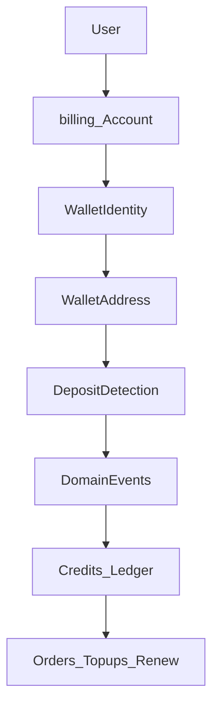

# RoamKit Wallet Platform — Architecture Vision

| Field | Value |
|-------|-------|
| Status | **Draft / Vision** (non-normative) |
| Date | 2026-08 |
| Audience | Product + Engineering |
| Related | [ADR 010](../adr/010-polygon-usdt-prepaid-credits.md) (Accepted — current production money path) |

> **This document is intentionally non-normative. No implementation may rely on this vision until the relevant ADR is accepted.**

Today’s production deposits and credits remain governed by **ADR 010**. This vision describes a long-term **RoamKit 2.0** direction: a Wallet **funding** layer, a clear **conversion** into Credits, and a business layer that runs entirely on the Credits ledger.

Also see: [Wallet Conversion Boundary](./wallet-conversion-boundary.md).

---

## Design Goals

1. Make funding simple for non-crypto users.
2. Keep blockchain complexity away from the product UI.
3. Preserve auditable credit accounting.
4. Avoid vendor lock-in (exchange, custody, indexer, or chain).
5. Support gradual evolution of **platform** deposit key infrastructure (keystore → HSM) if needed for receive/sweep — **not** for product spend.
6. Keep funding providers interchangeable.
7. Make multi-chain **additive**, never disruptive.

---

## Architecture Principles

1. **Wallet owns on-chain assets** (until converted).
2. **Credits own purchasing power.**
3. **Funding Boundary:** *The blockchain boundary ends at credit conversion. All product operations execute exclusively against the Credits ledger.*
4. **Funding providers are pluggable.**
5. **Chains are pluggable.**
6. **Wallet never depends on a single exchange.**
7. **Billing never depends on a single blockchain implementation.**
8. **Security decisions must not change public APIs.**

### Compatibility principles (backward compatibility)

- Existing user balances must remain valid.
- Existing `CreditService` ledger remains authoritative until explicitly superseded by an Accepted ADR.
- Wallet evolution must preserve existing customer funds.
- Future migrations require explicit cutover plans.

---

## Three layers

```text
Funding Layer      (blockchain / ramps)
        ↓
Conversion Layer   (Wallet Deposit → Credits)
====================
Blockchain boundary
====================
        ↓
Business Layer     (Credits → orders / renew)
```

```text
Funding
  ↓
Deposit
  ↓
Credit Conversion
====================
Blockchain boundary
====================
  ↓
Credits Ledger
  ↓
Orders / Top-ups / Subscriptions / Renew
```

After conversion there is **no** product blockchain transaction, **no** gas for renewals, and **no** signing as the user for eSIM spend.

---

## Context and problem

ADR 010 delivers v1: Polygon USDT to a shared platform wallet → RPC verify → `CreditService`. That remains production law until cutover.

Long-term, RoamKit needs per-Account funding identity and pluggable ramps **without** turning the product into a custodial “spend from chain” crypto wallet. Exchanges (e.g. MEXC) are **Funding Providers** (“Buy USDT → withdraw to RoamKit address”), never the Credits source of truth.

Public brand: **RoamKit Wallet** / `wallet.roamkit.net`.

---

## Domain map

```text
roamkit.net
├── app.roamkit.net
├── api.roamkit.net
├── wallet.roamkit.net   # funding / receive / convert UX
├── billing.roamkit.net  # Credits / ledger (boundary TBD)
└── admin.roamkit.net
```

---

## Core model: Wallet ≠ Credits ≠ Deposit Address

| Concept | Role |
|---------|------|
| **WalletIdentity** | Logical funding wallet for an Account |
| **WalletAddress** | Time-bound receive endpoint on a Chain |
| **Credits** | Only operational balance for the product (`CreditService`) |



Registration creates **WalletIdentity**; first address materialization is an open decision.

---

## Key types (do not confuse)

### User Spending Key

- The user’s own private key (e.g. MetaMask) used to **spend** or control funds they hold.
- **RoamKit never stores User Spending Keys.**
- Needed only if the user later uses BYO external wallet for sends, or a future **Withdraw** product that returns on-chain assets to the user.

### Platform Deposit Key

- Key material (or custody-provider control) used to **generate receive addresses** and optionally **sweep** inbound USDT to treasury.
- This is **platform infrastructure**, not a “user secret.”
- Required only if RoamKit issues per-user deposit addresses itself (vs a third-party Address Provider that holds keys).
- **Not** used to auto-renew subscriptions or buy eSIMs.

Future RFC: **Platform Wallet Key Management** (formerly “Managed Key Storage”) covers Platform Deposit Keys / sweeps — not subscription signing.

---

## Wallet Lifecycle

```text
Created → Active → Frozen → Compromised → Rotated → Archived
```

Active means receive / convert may proceed—not that the platform signs product purchases on-chain.

---

## Address Provider / Chain Adapter / Deposit Detection

Unchanged intent from prior vision: pluggable Address Provider, Chain Adapter (Polygon first), Deposit Detection via RPC/Indexer/Explorer adapters. Detection emits events; does not call `CreditService` directly.

---

## Wallet Event Bus

```text
DepositDetected → DepositConfirmed → CreditGranted
```

---

## Funding Provider

Examples: MEXC, Binance, MoonPay, Transak, external wallet send. RoamKit does **not** credit from exchange `hisrec` as SoT. Attribution uses WalletAddress ownership.

---

## Managed receive vs External send (hybrid)

| Mode | Meaning | Product renew |
|------|---------|----------------|
| **Platform-issued addresses** | RoamKit (or Address Provider) issues deposit addresses; may involve Platform Deposit Keys | Credits ledger |
| **External send** | User sends from MetaMask/etc. to a RoamKit address | Credits ledger |

**Non-goal:** platform signs subscription or order payments on-chain on the user’s behalf.

---

## Auto renew (target path)

```text
Credits Ledger → Subscription / renew via CreditService
```

Renew does **not** touch Wallet keys or the chain after Credits exist.

---

## Billing / Credits Engine

- Convert only after confirmed deposits (ADR rules).
- All product spend on Credits.
- ADR 010 remains production until Wallet/Credits ADRs + cutover.

---

## Security (summary)

- Never store User Spending Keys.
- Platform Deposit Keys (if any): keystore → optional HSM; separation of duties; audit.
- Incident classes: platform key leak, double credit, wrong network, detection outage.

---

## Wallet Recovery (platform)

Platform DR for deposit-key material / index rebuild — not user seed-phrase UX for spending.

---

## Open architectural decisions

1. Address discovery / first address timing / HD.
2. Whether Platform Deposit Keys are in-house or via Address Provider.
3. Sweep policy and treasury destination.
4. Conversion UX (auto vs confirm).
5. `billing.roamkit.net` deployable boundary.
6. Migration from shared `POLYGON_PLATFORM_WALLET`.

---

## Proposed future ADR / RFC sequence

| Item | Scope |
|------|--------|
| [RFC 003](../rfcs/003-wallet-domain-ownership-model.md) | Domain & ownership |
| Wallet Sandbox | Isolated PoCs |
| **RFC 004 — Platform Wallet Key Management** | Platform Deposit Keys / sweeps (if needed) |
| RFC 005 | Funding Provider interface |
| RFC 006 | Deposit Detection |
| ADRs | Wallet Platform, Funding, Credits Engine |

---

## Capability roadmap

| Capability | Status |
|------------|--------|
| Wallet Platform | Vision |
| Funding → Credits conversion | Vision |
| Platform-issued deposit addresses | Planned |
| Funding Providers | Planned |
| Deposit Detection | Planned |
| Platform Wallet Key Management | Planned (only if self-custody of deposit keys) |
| HSM for platform deposit keys | Future |
| Multi-chain | Future |
| On-chain Withdraw to user | Future (optional) |

---

## Non-goals (this vision)

- Storing User Spending Keys
- On-chain auto renew / gas for subscriptions
- Exchange API as Credits SoT
- Implementing custody or multi-chain **now**
- Silent amendment of ADR 010

---

## Architecture Decision Record lifecycle

```text
Vision → RFC → ADR → Capability → Production
```

**No implementation may rely on this vision until the relevant ADR is accepted.**

---

## Recommended next steps

1. Keep production on **ADR 010**.
2. Stabilize **RFC 003** (domain).
3. [Wallet Conversion Boundary](./wallet-conversion-boundary.md) (why chain stops at convert).
4. Wallet Sandbox ([research framework](./wallet-sandbox.md)) → RFC 004 (Platform Wallet Key Management) → 005 → 006 → first Wallet ADR.

---

## Related

- [Wallet Conversion Boundary](./wallet-conversion-boundary.md)
- [RFC 003 — Wallet Domain & Ownership Model](../rfcs/003-wallet-domain-ownership-model.md)
- [ADR 010](../adr/010-polygon-usdt-prepaid-credits.md)
- [ADR 012](../adr/012-billing-extensibility-rules.md)
- [ADR 005](../adr/005-domain-events.md)
- [Deposit UX observation](../ops/deposit-ux-observation.md)
- [System overview](./overview.md)
