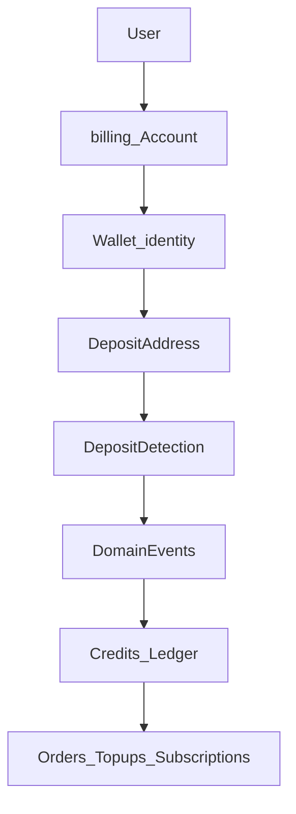

# RoamKit Wallet Platform — Architecture Vision

| Field | Value |
|-------|-------|
| Status | **Draft / Vision** (non-normative) |
| Date | 2026-08 |
| Audience | Product + Engineering |
| Related | [ADR 010](../adr/010-polygon-usdt-prepaid-credits.md) (Accepted — current production money path) |

> **This document is intentionally non-normative. No implementation may rely on this vision until the relevant ADR is accepted.**

Today’s production deposits and credits remain governed by **ADR 010**. This vision describes a long-term **RoamKit 2.0** platform direction: a first-class Wallet service, pluggable funding and chains, and a clean split between on-chain assets and purchasable Credits.

---

## Design Goals

Why this architecture exists:

1. Make funding simple for non-crypto users.
2. Keep blockchain complexity away from the product UI.
3. Preserve auditable credit accounting.
4. Avoid vendor lock-in (exchange, custody, indexer, or chain).
5. Support gradual evolution from managed keystore to HSM.
6. Keep funding providers interchangeable.
7. Make multi-chain **additive**, never disruptive.

---

## Architecture Principles

Constitution for the Wallet platform:

1. **Wallet owns on-chain assets.**
2. **Credits own purchasing power.**
3. **Funding providers are pluggable.**
4. **Chains are pluggable.**
5. **Wallet never depends on a single exchange.**
6. **Billing never depends on a single blockchain implementation.**
7. **Security decisions must not change public APIs.**

### Compatibility principles (backward compatibility)

Business promise: **never endanger existing customer funds**.

- Existing user balances must remain valid.
- Existing `CreditService` ledger remains authoritative until explicitly superseded by an Accepted ADR.
- Wallet evolution must preserve existing customer funds.
- Future migrations require explicit cutover plans (no silent rewrites of the money path).

---

## Context and problem

ADR 010 delivers a working v1: Polygon-only USDT to a **shared** platform wallet, RPC verification, exact-match credits via `CreditService`. Deposit UX (PR0–PR5) improves that path without changing financial invariants.

Long-term limits of “one shared address + one chain”:

- Attribution and UX pressure users toward a single network.
- Treating an exchange API as a credit source couples RoamKit to one vendor’s custody and status model.
- Adding chains or ramps without a Wallet identity layer forces repeated redesign of billing.

**RoamKit Wallet** inverts the question: accept funds from anyone into a user-scoped Wallet identity; exchanges and wallets become **funding channels**, not the source of truth for Credits.

Public brand: **RoamKit Wallet** / `wallet.roamkit.net` (no customer-facing third-party product name).

---

## Domain map

```text
roamkit.net
├── app.roamkit.net      # product UI
├── api.roamkit.net      # platform API
├── wallet.roamkit.net   # Wallet service / UI (core)
├── billing.roamkit.net  # Credits / ledger surface (deploy boundary TBD)
└── admin.roamkit.net    # operations
```

Wallet is a **core platform service**, not a side project.

---

## Core model: Wallet ≠ Credits ≠ Deposit Address

```text
USDT (on-chain, Wallet)
        ↓
   domain events
        ↓
   CreditService
        ↓
RoamKit Credits → orders / top-ups / subscriptions
```

| Concept | Role |
|---------|------|
| **Wallet** | Identity and custody unit (lifecycle, keys or external link) |
| **Deposit Address** | Receive endpoint on a specific chain (many per Wallet over time) |
| **Credits** | Purchasing power in the ledger (`CreditService`) |



**Registration** creates a **Wallet identity**. Materializing the first deposit address is an **open decision** (eager vs lazy / HD / per-payment)—do not lock “Account + Wallet + address” at signup in this vision.

Users need not open a crypto-native UI. Product language can stay: Balance, Add funds, Auto renew.

---

## Wallet Lifecycle

States from day one (avoid inventing them under incident pressure):

```text
Created → Active → Frozen → Compromised → Rotated → Archived
```

| State | Example triggers |
|-------|------------------|
| Created | Wallet identity provisioned |
| Active | Normal receive / convert / (managed) sign |
| Frozen | Risk hold, support freeze, policy hold |
| Compromised | Suspected key or account takeover |
| Rotated | New address set / key material after migration or compromise |
| Archived | Account closure; retain audit history |

Supports lost-account flows, compromise response, HSM migration, and chain evolution without ad-hoc flags.

---

## Address Provider

```text
Wallet → Address Provider → Deposit Address(es)
```

| Era | Example providers |
|-----|-------------------|
| Near-term | Internal generator |
| Later | Fireblocks, BitGo, MPC, HSM-backed provider |

Wallet domain logic must not embed a specific key-generation vendor.

---

## Chain Adapter

```text
Wallet → Chain Adapter → Polygon (v1)
                      → Arbitrum / Base / Ethereum / … (later)
```

The Wallet service does not hard-code chain RPCs, contracts, or confirmation rules. Adapters do. Multi-chain is **additive**.

---

## Deposit Detection

Separate capability—**not** bound to one transport:

```text
Deposit Detection
  ├── RPC adapter
  ├── Indexer adapter
  └── Future explorer adapter
```

Do not couple detection permanently to a single RPC, Etherscan, or exchange API. Those are adapters. Detection **emits events**; it does not call `CreditService` directly.

---

## Wallet Event Bus

Preferred money-path coupling:

```text
DepositDetected → DepositConfirmed → CreditGranted
```

Events enable audit, replay, analytics, and webhooks without a hard Wallet → `CreditService` import cycle. Aligns with the spirit of [ADR 005](../adr/005-domain-events.md) (exact bus technology is an ADR decision).

---

## Funding Provider

Pluggable interface (not a monolithic “funding layer”):

| Provider examples | Role |
|-------------------|------|
| MEXC, Binance, OKX, Coinbase Pay | “Buy USDT” / withdraw to user address |
| MoonPay, Transak | Card / fiat on-ramp |
| External wallet send | User pays from MetaMask, etc. |

RoamKit does **not** treat any exchange deposit history as the Credits source of truth. Attribution in the Wallet model is natural once per-user (or per-payment) addresses exist.

---

## Managed vs External (hybrid)

| Mode | Custody | Auto renew / subscriptions |
|------|---------|----------------------------|
| **Managed Wallet** | Platform holds signing capability (keystore → HSM roadmap) | Supported |
| **External Wallet** | User connects MetaMask / Rabby / Ledger | Limited / no automatic signing unless explicitly designed later |

Product may offer both; automation features require Managed (or a later delegated-signing ADR).

---

## Auto renew (target path)

```text
Managed Wallet signs → Credits funded → Subscription / spend via CreditService
```

Spend semantics stay in the Credits engine, not “pay the eSIM provider from chain” in v1 of this vision.

---

## Billing / Credits Engine

- Conversion Wallet → Credits happens **after** confirmed deposit events (rules: amount, fees, confirmations—ADR territory).
- Credits → orders / top-ups / subscriptions remain ledger-backed and auditable.
- Relationship to ADR 010: production continues on ADR 010 until a **Credits Engine** / **Wallet Platform** ADR set is Accepted and a cutover plan exists. Vision does not silently rewrite ADR 010.

---

## Security (summary)

- Custodial Managed Wallet is a **security product decision**, not a UI convenience.
- Encrypted keystore first; **HSM migration** as a planned capability (see roadmap).
- Separation of duties for key ops; append-only audit of signing and lifecycle transitions.
- Incident classes: key leak, double credit, wrong-network deposit, indexer/RPC outage.

---

## Wallet Recovery (platform)

Not “user seed phrase UX”—**system recovery**:

- Lost backup / keystore disaster
- HSM migration
- Disaster recovery of Wallet service
- Rebuild of chain index / detection state

Documented early so DR is not invented during an outage.

---

## Open architectural decisions

Documented, **not** decided in this vision:

1. **Address discovery** on Receive: one permanent address vs new address per deposit vs HD derivation.
2. When to materialize the **first** address (registration vs first “Add funds”).
3. Custody jurisdiction / compliance posture for Managed Wallet.
4. Conversion UX: auto-credit vs user confirm.
5. Whether `billing.roamkit.net` is a separate deployable.
6. Migration path from today’s shared `POLYGON_PLATFORM_WALLET` to per-user addresses.

---

## Proposed future ADR hierarchy

| Future ADR | Scope |
|------------|--------|
| **RoamKit Wallet Platform** | Wallet identity, lifecycle, keys/signing, Address Provider |
| **Wallet Funding** | Funding Provider interface + channel implementations |
| **Credits Engine** | Ledger, credits, subscriptions, orders (extract/clarify from ADR 010) |
| Later as needed | Deposit Detection, Chain Adapters, HSM |

Do not implement from this vision alone—see lifecycle below.

---

## Capability roadmap

| Capability | Status |
|------------|--------|
| Wallet Platform | Vision |
| Managed Wallet | Planned |
| Funding Providers | Planned |
| Deposit Detection | Planned |
| Wallet Security | Planned |
| HSM Migration | Future |
| Multi-chain | Future |

Break the vision into small capabilities; avoid one mega-project.

---

## Non-goals (this vision)

- Implementing custody, HSM, or per-user addresses **now**
- Multi-chain launch or swap/staking
- Binding Credits to MEXC/`hisrec` or any single exchange
- Silent amendment of ADR 010
- Replacing Deposit UX observation process (current ADR 010 path remains valid)

---

## Architecture Decision Record lifecycle

How this vision becomes law:

```text
Vision
  ↓
RFC (if a PoC or contested design is needed)
  ↓
ADR (Accepted)
  ↓
Capability (implementation)
  ↓
Production
```

Again: **This document is intentionally non-normative. No implementation may rely on this vision until the relevant ADR is accepted.**

Saying “but it was in the vision doc” is not sufficient to skip an ADR.

---

## Recommended next steps

1. Review and accept this document as **Draft / Vision** (direction only).
2. Keep production money path on **ADR 010** until cutover ADRs exist.
3. Freeze work that assumes exchange-as-SoT or silent multi-chain billing.
4. Review and iterate **[RFC 003 — Wallet Domain & Ownership Model](../rfcs/003-wallet-domain-ownership-model.md)** (domain language before keys/funding/detection).
5. Then: Wallet Sandbox (isolated PoCs) → RFC 004–006 → first **RoamKit Wallet Platform** ADR.
6. Only after Accepted ADRs: capabilities and implementation PRs.

---

## Related

- [ADR 010 — Polygon USDT prepaid credits](../adr/010-polygon-usdt-prepaid-credits.md)
- [ADR 012 — Billing extensibility rules](../adr/012-billing-extensibility-rules.md)
- [ADR 005 — Domain events](../adr/005-domain-events.md)
- [Deposit UX observation](../ops/deposit-ux-observation.md)
- [Capability status](../ops/capability-status.md)
- [System overview](./overview.md)
