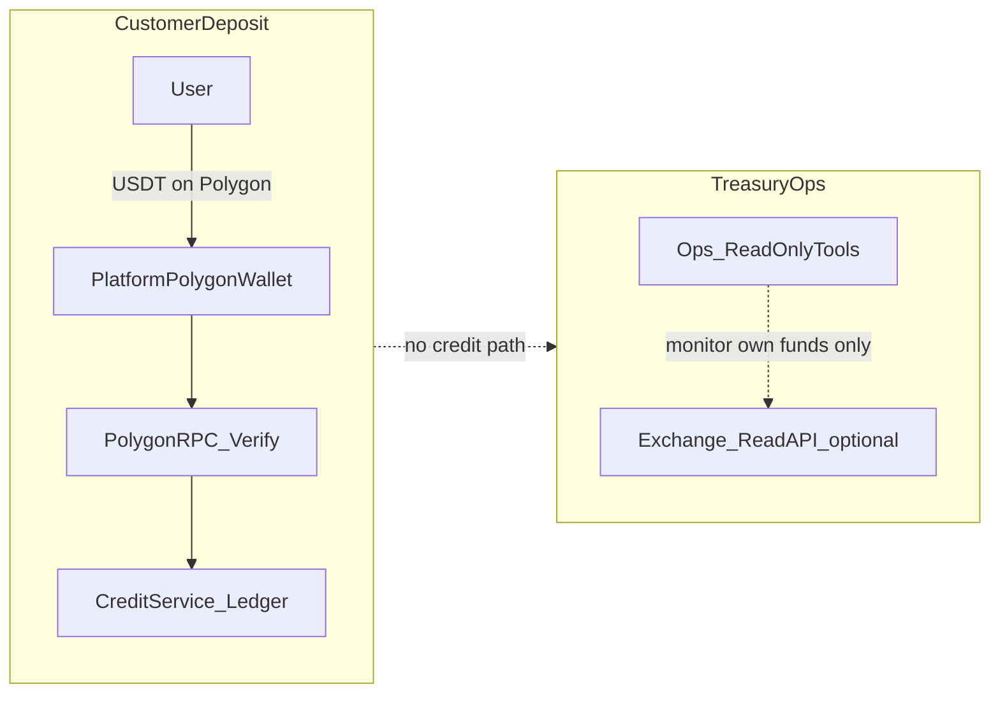

# Deposit UX observation

Non-normative ops note. Architecture rules live only in [ADR 010](../adr/010-polygon-usdt-prepaid-credits.md). This file does not amend ADR 010.

| Field | Value |
|-------|-------|
| Capability | Deposit UX (web PR0–PR5 + API amount-retry PR3a) |
| Status | Closed for new feature work; **observation in progress** |
| Architecture SoT | [ADR 010](../adr/010-polygon-usdt-prepaid-credits.md) (Accepted) |
| Related matrix | [Capability status](./capability-status.md) |

## Ownership

| Field | Value |
|-------|--------|
| Observation owner | Product |
| Review cadence | After 7 days (single review unless observation is extended) |
| GO / CLOSE authority | Product + Engineering |

## Boundary: Customer Deposit vs Treasury / Ops

Customer credits must never depend on exchange APIs or custodial deposit histories. ADR 010 money path is on-chain Polygon verification into the platform wallet, then `CreditService` / ledger.



**Boundary (locked):** Treasury / ops tooling (including any exchange read API used to watch RoamKit’s own funds) is **never** a customer credit source. It must not write to `CreditService`, the ledger, or `DepositRequest` verification.

Do **not** document exchange API keys, endpoints, IP allowlists, or runbooks in this file. Those belong in a separate treasury capability if one is ever opened.

## What shipped (reference)

Functional work is complete on `develop` and promoted with deposit billing to production (web promote including PR0–PR5). Scope was UX + same-account mismatch retry only; exact-match and Polygon-only rules from ADR 010 were not changed.

| Slice | Role |
|-------|------|
| PR0 | Locked deposit telemetry event names |
| PR1 | Polygon PoS network warning + copy |
| PR2 | Explorer links |
| PR3a | API same-account FAILED amount correction + `AMOUNT_MISMATCH` |
| PR3b | Mismatch UI + retry telemetry |
| PR4 | Dedicated CEX panel |
| PR5 | Pending session resume banner |

## KPI rates (observation window)

Track **rates / trends** over ~7 days, not raw counts alone. Use **only** existing locked deposit telemetry (and API failure code `AMOUNT_MISMATCH` on verify). Do not invent new event names for this observation.

| KPI | Definition sketch |
|-----|-------------------|
| `AMOUNT_MISMATCH` rate | Verify failures with `code: AMOUNT_MISMATCH` / verify attempts (`deposit_verify_clicked` or equivalent verify starts) |
| Retry success rate | `deposit_retry_success` / `deposit_retry_clicked` |
| Explorer usage rate | `deposit_explorer_opened` / `deposit_page_open` (or per-verify if dashboards prefer) |
| Pending resume rate | `deposit_pending_resumed` / verifies that entered a pending poll path |
| Verify completion rate | `deposit_verify_succeeded` / `deposit_verify_clicked` (inverse proxy for abandonment) |

Supporting events already in the catalog: `deposit_verify_failed`, `deposit_poll_*`, `deposit_copy_address_clicked`, etc. Prefer `deposit_verify_failed` + `code: AMOUNT_MISMATCH` over a parallel mismatch event name.

## Exit criteria

After ~7 days (unless stopped earlier), Product + Engineering review the KPI rates, then fill the **Decision log** below.

Normal outcomes: close capability as observed, extend the window, open a **new** follow-up capability, or open an ADR discussion. No silent scope expansion.

## Stop criteria

Abort the calm observation window and open a **hotfix** capability immediately if any of the following occur:

- Critical regression in the verify flow (customers cannot complete legitimate deposits)
- Material rise in support tickets tied to deposits / wrong network / amount mismatch
- Unexpected spike in `AMOUNT_MISMATCH` rate after the UX/recovery changes
- Duplicate credit or other ledger integrity incident

## Decision log

Fill after the observation review (or after a stop-criteria abort).

```text
Observation window: ________ → ________
Observation result: …

Decision:
□ Close capability (Observed ✅)
□ Extend observation
□ Open follow-up capability
□ Open ADR discussion

Signed (Product): ________
Signed (Engineering): ________
Date: ________
```

## Deferred backlog (hard gate)

None of the following may start without a **new capability** decision and, where architecture changes, a **new or amended ADR**:

- Tabs / progressive disclosure on `/me/deposit`
- Multi-chain deposits (ERC-20, TRC-20, BSC, etc.) — **not planned**; would require a new ADR
- Exchange / MEXC (or similar) payment rail as customer credit source
- ADR amount-policy change (“credit received amount” / tolerance) — only if mismatch metrics remain high after recovery UX

Multi-chain is **not** a small UI dropdown on top of ADR 010. It implies different addresses, RPCs, confirmations, minima, fees, reconciliation, and schema/API changes.

## Related

- [ADR 010 — Polygon USDT prepaid credits](../adr/010-polygon-usdt-prepaid-credits.md)
- [Capability status](./capability-status.md)
- [Billing dashboard](./billing-dashboard.md) (when metrics are wired)
