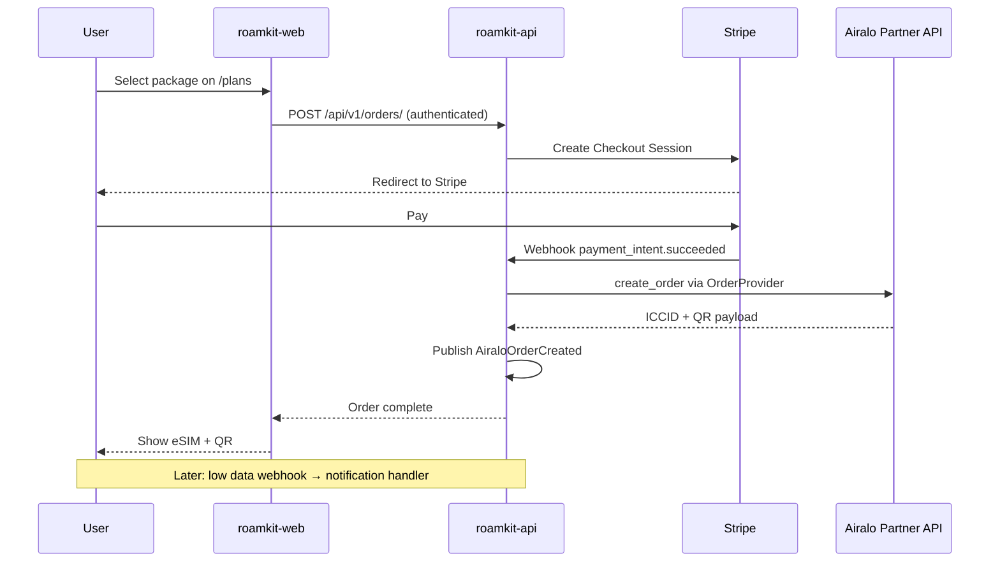

# RFC 001: Self-service eSIM purchase and top-up flow

| Field | Value |
|-------|-------|
| Status | Draft |
| Date | 2026-07 |
| Authors | Product / Engineering |

## Summary

End-to-end customer journey: browse packages → pay → receive eSIM → monitor usage → purchase top-up — without manual ops intervention.

## Goals

- Self-service purchase on web (mobile later via same API).
- Stripe Checkout for payment (test on staging, live in production).
- Airalo Partner API for fulfillment and top-ups.
- Email notifications for order confirmation and low-data alerts.

## Non-goals (this RFC)

- Native mobile app UI (Flutter repo not open yet).
- Multi-currency pricing engine beyond provider list prices + margin rules.
- B2B reseller portal.

## User flow

## API additions (Faza 3)

| Method | Path | Notes |
|--------|------|-------|
| `POST` | `/api/v1/orders/` | Create pending order + Stripe session |
| `POST` | `/api/v1/webhooks/stripe/` | Verify signature, complete order |
| `GET` | `/api/v1/me/esims/` | List user eSIMs (Faza 2) |
| `GET` | `/api/v1/me/esims/{id}/usage/` | Usage from provider |
| `POST` | `/api/v1/me/esims/{id}/topups/` | Top-up via TopupProvider |

## Domain events

| Event | When | Handlers (initial) |
|-------|------|-------------------|
| `PackagesSynced` | Celery sync job | Cache invalidation (optional) |
| `AiraloOrderCreated` | Order fulfilled | Email stub, audit log |
| `TopupCompleted` | Top-up success | Email stub |
| `LowDataThresholdReached` | Usage poll / webhook | Email + in-app (later) |

## Provider usage

- `PackageProvider` — catalog sync (Faza 1).
- `OrderProvider` — fulfillment after payment (Faza 2–3).
- `TopupProvider` — self-service top-up (Faza 3).
- `PaymentProvider` — Stripe (Faza 3).

See [provider abstractions](../architecture/provider-abstractions.md).

## Data model (sketch)

- `Order`: user, package_id, status, stripe_session_id, external_order_id.
- `Esim`: user, iccid, qr_payload, status, provider_ref.
- `Topup`: esim, package_id, status, external_ref.

Exact schema defined in `roamkit-api` during implementation.

## Security

- Stripe webhooks: verify `STRIPE_WEBHOOK_SECRET`.
- User eSIM endpoints: JWT required; object-level permission checks.
- No ICCID or QR in public URLs without auth.

## Staging validation

1. Stripe test mode checkout end-to-end.
2. Airalo sandbox order creates real sandbox eSIM.
3. Smoke test remains: health + `GET /api/v1/packages/`.
4. Manual Partner Platform test (20 eSIM batch) in parallel during Faza 2.

## Open questions

- [ ] Margin/markup rules: fixed % vs per-package override table?
- [ ] Refund policy and Stripe refund webhook handling?
- [ ] Low-data threshold: configurable per package or global default?

## Promotion

When accepted, extract any new architectural choices into ADRs (e.g. payment provider pattern). Implementation tracked in Faza 2–3 milestones.

## Related

- [ADR 004](../adr/004-provider-interfaces.md)
- [ADR 005](../adr/005-domain-events.md)
- Airalo Partner API: https://developers.partners.airalo.com/
