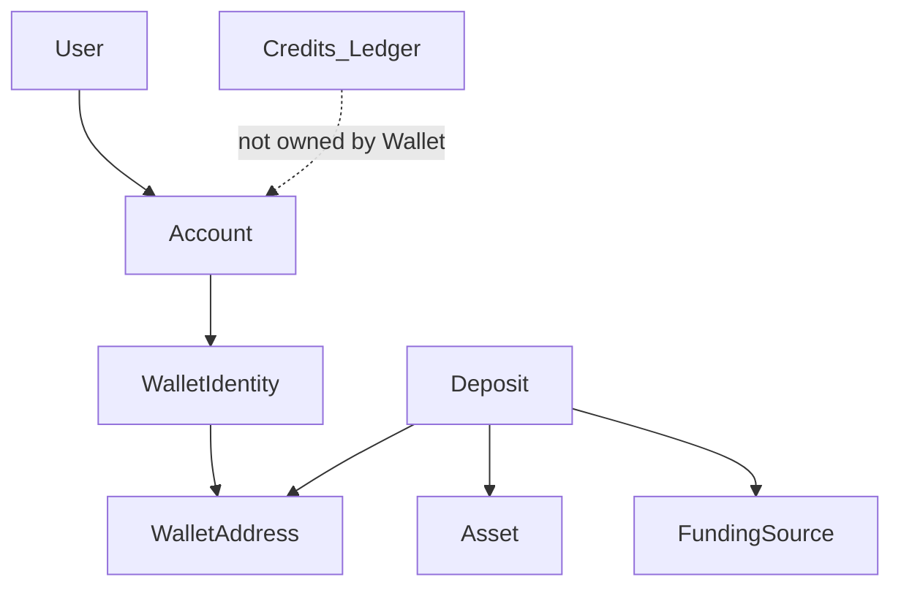

# RFC 003: Wallet Domain & Ownership Model

| Field | Value |
|-------|-------|
| Status | **Architecture Review Passed / Frozen** (2026-08) |
| Date | 2026-08 |
| Authors | Product / Engineering |
| Parent | [RoamKit Wallet Platform Vision](../architecture/roamkit-wallet-platform-vision.md) |
| Also | [Wallet Conversion Boundary](../architecture/wallet-conversion-boundary.md) |
| Template | [TEMPLATE-wallet.md](./TEMPLATE-wallet.md) |
| Freeze | [Wallet Architecture Freeze](../architecture/wallet-architecture-freeze.md) |

> This RFC is a proposal. It does **not** amend [ADR 010](../adr/010-polygon-usdt-prepaid-credits.md). No implementation may treat this document as normative until a related ADR is Accepted.
>
> **Architecture Freeze:** further modifications require evidence from subsequent research tracks or a new ADR proposal.

## Problem

The Wallet Vision describes funding into a per-Account logical wallet, then **conversion into Credits**, after which all product spend (including auto renew) uses the Credits ledger only. Before key management or funding adapters are designed, RoamKit needs a shared **domain language and ownership graph**. Without that, later RFCs will bake Polygon/USDT/vendors into the core model or blur “user spend keys” with “platform deposit keys.”

## Goals

- Define ownership: `Account → WalletIdentity → WalletAddress` (not User → Wallet).
- Separate **WalletIdentity** from time-bound **WalletAddress**.
- Introduce **Asset** and abstract **Deposit** (Deposit → **WalletAddress**).
- Distinguish **FundingSource** (domain) from **FundingProvider** (RFC 005).
- Define Deposit **state machine** and **Identity vs Capability** (receive/convert — not on-chain renew).
- State **domain invariants**, including ledger independence and **no irreversible conversion until invariants hold**.
- Stay abstract: no MEXC/Etherscan/Fireblocks/HSM/UI implementation.

## Non-goals

- Platform Wallet Key Management (RFC 004 — deposit/sweep keys, not user spend keys).
- Funding Provider interface (RFC 005).
- Deposit Detection adapters (RFC 006).
- Wallet Sandbox lab setup.
- Schema/API/production code.
- Changing ADR 010.

## Domain

### Ownership

```text
User
  ↓
Account
  ↓
WalletIdentity
  ↓
WalletAddress (1..N, time-bound)
  ↓
Deposit (references WalletAddress)
```

```text
Deposit → WalletAddress → WalletIdentity → Account
```

- WalletIdentity belongs to exactly one Account (never directly to User).
- First address materialization remains an open decision.

### WalletAddress lifecycle

Addresses are **not necessarily eternal**:

```text
WalletIdentity
  ├── WalletAddress #1 (active)
  ├── WalletAddress #2 (retired)
  └── WalletAddress #3 (future / reserved)
```

States at minimum: **active**, **retired** (optional: pending). Rotation is allowed by the model even if v1 never rotates.

### Core entities

| Entity | Role |
|--------|------|
| **WalletIdentity** | Logical funding wallet |
| **WalletAddress** | Receive endpoint on a **Chain** (lifecycle above) |
| **Chain** | Network identity |
| **Asset** | e.g. USDT, USDC, EURC — not hard-coded into entity names |
| **FundingSource** | *Kind* of inbound: on-chain transfer, exchange withdrawal, card purchase, … |
| **FundingProvider** | *Who* facilitated funding (MEXC, Binance, MoonPay, …) — **out of RFC 003**; see RFC 005 |
| **Deposit** | Inbound **Asset** observed against a **WalletAddress** |



### Identity vs Capability

```text
WalletIdentity
    ↓
Capabilities (near-term)
    • Receive
    • Hold              (optional / policy)
    • ConvertToCredits
```

**Not** Wallet capabilities for product v1:

- **AutoRenew** — lives on **Credits** / billing after conversion ([Conversion Boundary](../architecture/wallet-conversion-boundary.md)).
- **Withdraw** — future optional Wallet capability if on-chain payouts exist; not required for eSIM renew.

### Deposit (abstract)

| Field | Meaning |
|-------|---------|
| WalletAddress | Address that received the value (required for audit) |
| FundingSource | Kind of inbound (not the vendor name) |
| Asset | What was transferred |
| Chain | Where observed (when on-chain) |
| Amount | Quantity |
| Status | State machine below |

### Deposit state machine

```text
Created → Detected → Confirming → Confirmed → Credited
                 ↘ Failed
                 ↘ Expired
```

Conversion to Credits occurs only on the **Confirmed → Credited** path (via events / CreditService), never before invariants are satisfied.

### Domain invariants

1. WalletIdentity belongs to exactly one Account.  
2. WalletAddress belongs to exactly one WalletIdentity.  
3. Deposit belongs to exactly one WalletAddress (hence one WalletIdentity / Account).  
4. Credits never belong to Wallet.  
5. Wallet never owns Orders.  
6. **Wallet state must never affect the integrity of the Credits ledger.** Outages may delay *new* credits; they must not corrupt ledger history. Renewals that already have Credits do not require Wallet availability.  
7. **No irreversible operations until invariants hold:** *No blockchain settlement assumption or credit conversion may become irreversible until all domain invariants are satisfied.* In practice: do not Credited until Deposit is Confirmed under policy; Credits mutations only via `CreditService`.

### FundingSource ≠ FundingProvider

| | FundingSource | FundingProvider |
|---|---------------|-----------------|
| Layer | Domain (this RFC) | Integration (RFC 005) |
| Examples | On-chain transfer, exchange withdrawal, card purchase | MEXC, Binance, MoonPay, Transak |

Same source kind can be fulfilled by many providers over time without changing the Deposit model.

### Relationship to ADR 010

Production stays on ADR 010 until Wallet ADRs + cutover. This RFC describes the **future** domain vocabulary for funding → Credits, aligned with the Vision’s Funding Boundary.

## Open Questions

1. First WalletAddress timing; permanent vs per-deposit vs HD.  
2. Address lifecycle transitions and who may retire an address.  
3. FundingSource storage (enum vs entity) vs link to FundingProvider id.  
4. Capability storage/authorization.  
5. Asset precision registry vs ADR 010 Decimal(20,6).  
6. Whether Hold is a real capability or implied by unconverted balance.  
7. Platform Deposit Keys needed? (→ RFC 004) vs Address Provider only.

## Exit Criteria

- [ ] Ownership Account → WalletIdentity → WalletAddress accepted.  
- [ ] Deposit → WalletAddress accepted.  
- [ ] Address lifecycle accepted.  
- [ ] FundingSource ≠ FundingProvider accepted.  
- [ ] Capabilities = receive/convert (renew on Credits) accepted.  
- [ ] Invariants including irreversible-ops and ledger independence accepted.  
- [ ] Open questions answered or deferred to Sandbox / RFC 004–006.  
- [ ] No production code required.

**Next:** [Wallet Sandbox](../architecture/wallet-sandbox.md) (research framework) → **RFC 004 — Platform Wallet Key Management** (not “user spend keys”).

## Related

- [RoamKit Wallet Platform Vision](../architecture/roamkit-wallet-platform-vision.md)
- [Wallet Conversion Boundary](../architecture/wallet-conversion-boundary.md)
- [ADR 010](../adr/010-polygon-usdt-prepaid-credits.md)
- [ADR 012](../adr/012-billing-extensibility-rules.md)
- [TEMPLATE-wallet.md](./TEMPLATE-wallet.md)
