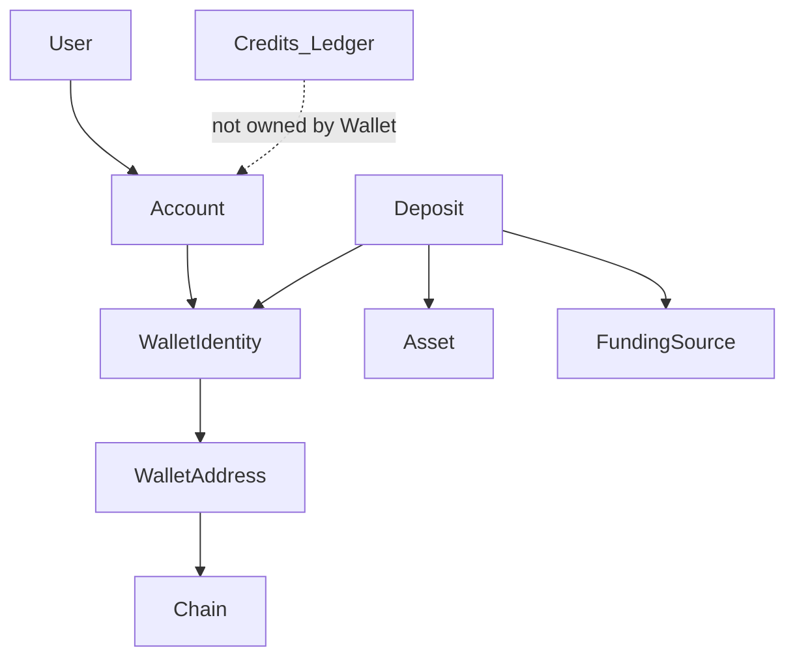

# RFC 003: Wallet Domain & Ownership Model

| Field | Value |
|-------|-------|
| Status | Draft |
| Date | 2026-08 |
| Authors | Product / Engineering |
| Parent | [RoamKit Wallet Platform Vision](../architecture/roamkit-wallet-platform-vision.md) |
| Template | [TEMPLATE-wallet.md](./TEMPLATE-wallet.md) |

> This RFC is a proposal. It does **not** amend [ADR 010](../adr/010-polygon-usdt-prepaid-credits.md). No implementation may treat this document as normative until a related ADR is Accepted.

## Problem

The Wallet Vision describes a long-term platform where each Account has a logical wallet, on-chain receive addresses, abstract deposits, and a conversion path into Credits. Before key storage, funding providers, or detection adapters are designed, RoamKit needs a **shared domain language and ownership graph**. Without that, later RFCs will embed Polygon/USDT/vendor assumptions into the core model and force costly refactors.

## Goals

- Define core Wallet domain entities and **ownership** aligned with `billing.Account` (not `User`).
- Separate **WalletIdentity** (logical) from **WalletAddress** (per-chain receive endpoints).
- Introduce **Asset** and abstract **Deposit** so USDT/Polygon are not baked into the domain names.
- Define a Deposit **state machine** usable across funding providers.
- Define **Identity vs Capability** so what a wallet *can* do evolves without boolean sprawl.
- State **domain invariants**, including ledger independence from Wallet operational state.
- Remain abstract: no MEXC, Etherscan, Fireblocks, HSM, MPC, or UI.

## Non-goals

- Managed key storage / signing implementation (RFC 004).
- Funding Provider interface or exchange integrations (RFC 005).
- Deposit Detection adapters / indexer / explorer wiring (RFC 006).
- Wallet Sandbox lab setup (separate architecture note).
- Schema migrations, API shapes, or production code.
- Changing ADR 010 or today’s shared `POLYGON_PLATFORM_WALLET` path.

## Domain

### Ownership

```text
User
  ↓
Account                 # financial owner (same spirit as ADR 010 billing.Account)
  ↓
WalletIdentity          # logical wallet
  ↓
WalletAddress (1..N)    # receive endpoints on Chains
```

- **WalletIdentity** belongs to exactly one **Account**.
- Do **not** attach WalletIdentity directly to User (preserves Business / Team accounts later).
- Registration (future) creates **WalletIdentity**; materializing the first **WalletAddress** remains an open decision (eager vs lazy / HD / per-payment).

### Core entities

| Entity | Role |
|--------|------|
| **WalletIdentity** | Logical wallet: lifecycle, capabilities, link to Account |
| **WalletAddress** | Deposit address on a specific **Chain** |
| **Chain** | Network identity (e.g. Polygon conceptually; others later) |
| **Asset** | Fungible unit of value (e.g. USDT, USDC, EURC) — not hard-coded to USDT |
| **FundingSource** | Abstract origin of an inbound transfer (provider-agnostic) |
| **Deposit** | Abstract inbound transfer of an **Asset** toward a WalletIdentity |



### Identity vs Capability

**WalletIdentity** describes what the wallet **is**. **Capabilities** describe what it **may do**, and can grow without scattering booleans across the system.

```text
WalletIdentity
    ↓
Capabilities (examples)
    • Receive
    • Hold
    • ConvertToCredits
    • AutoRenew          (future)
    • Withdraw           (future)
```

Near-term expected set (illustrative, not a product commit): **Receive**, **Hold**, **ConvertToCredits**. Adding **Withdraw** or **AutoRenew** later should be a capability grant / policy change, not a domain-model rewrite.

Exact capability catalog and storage shape are left to a later ADR; this RFC only requires the **separation** of identity and capability.

### Deposit (abstract)

A Deposit is not named “blockchain deposit.” Conceptual fields:

| Field | Meaning |
|-------|---------|
| FundingSource | Where the funds conceptually came from |
| Asset | What was transferred |
| Chain / Network | Where it was observed (when on-chain) |
| Amount | Quantity in Asset precision |
| Status | Position in the state machine below |
| WalletIdentity | Owner of the inbound transfer |

### Deposit state machine

```text
Created
  ↓
Detected
  ↓
Confirming
  ↓
Confirmed
  ↓
Credited

Any non-terminal path may also end in:
  → Failed
  → Expired
```

| Status | Intent |
|--------|--------|
| Created | Record opened (intent or first signal) |
| Detected | Observation of inbound value |
| Confirming | Waiting for confirmation policy |
| Confirmed | Safe to consider for credit conversion |
| Credited | Credits ledger updated (via CreditService / events) |
| Failed | Terminal failure |
| Expired | Terminal timeout / abandoned |

Event names in the Vision (`DepositDetected`, `DepositConfirmed`, `CreditGranted`) should map cleanly onto these statuses; exact event catalog is RFC 006 / ADR territory.

### Domain invariants

1. **WalletIdentity belongs to exactly one Account.**
2. **Deposit belongs to exactly one WalletIdentity.**
3. **Credits never belong to Wallet** — purchasing power stays on Account / ledger.
4. **Wallet never owns Orders** — spend remains a Credits / billing concern.
5. **WalletAddress belongs to exactly one WalletIdentity.**
6. **Wallet state must never affect the integrity of the Credits ledger.**  
   If the Wallet service is down, a chain is delayed, or deposit detection stalls, the **Credits ledger remains consistent**. Wallet outages may delay *new* credits; they must not corrupt existing ledger history or balances.

### Relationship to ADR 010 (today)

| Today (ADR 010) | This RFC (future domain) |
|-----------------|--------------------------|
| Shared platform wallet | Per-Account WalletIdentity + addresses |
| On-chain verify → CreditService | Deposit state machine → events → CreditService |
| USDT on Polygon only | Asset + Chain as first-class concepts |

Production continues on ADR 010 until Wallet ADRs and a cutover plan exist.

## Open Questions

1. When is the first WalletAddress materialized (signup vs first Add funds)?
2. Address discovery: permanent address vs new per deposit vs HD derivation?
3. Is `FundingSource` an entity, an enum, or a link to a Funding Provider id (RFC 005)?
4. How are Capabilities stored and authorized (flags table, policy engine, product plan)?
5. Precision / decimals: per Asset registry vs global Decimal(20,6) from ADR 010?
6. Lifecycle states for WalletIdentity (`Created` → `Active` → …) — confirm enum with Vision; any Deposit interaction rules while `Frozen`?

## Exit Criteria

This RFC is ready to close (or promote into a Wallet Platform ADR draft) when:

- [ ] Product + Engineering agree ownership is Account → WalletIdentity → WalletAddress.
- [ ] Asset and abstract Deposit are accepted (no USDT/Polygon hard-coding in entity names).
- [ ] Deposit state machine is accepted as the shared status vocabulary.
- [ ] Identity vs Capability separation is accepted.
- [ ] Domain invariants (including ledger independence) are accepted.
- [ ] Open questions are either answered or explicitly deferred to RFC 004–006 / Sandbox PoCs.
- [ ] No production code was required to validate this RFC.

**Next after review of RFC 003:** Wallet Sandbox note (if PoCs needed), then RFC 004 — not an ADR yet.

## Related

- [RoamKit Wallet Platform Vision](../architecture/roamkit-wallet-platform-vision.md)
- [ADR 010 — Polygon USDT prepaid credits](../adr/010-polygon-usdt-prepaid-credits.md)
- [ADR 012 — Billing extensibility rules](../adr/012-billing-extensibility-rules.md)
- [TEMPLATE-wallet.md](./TEMPLATE-wallet.md)
